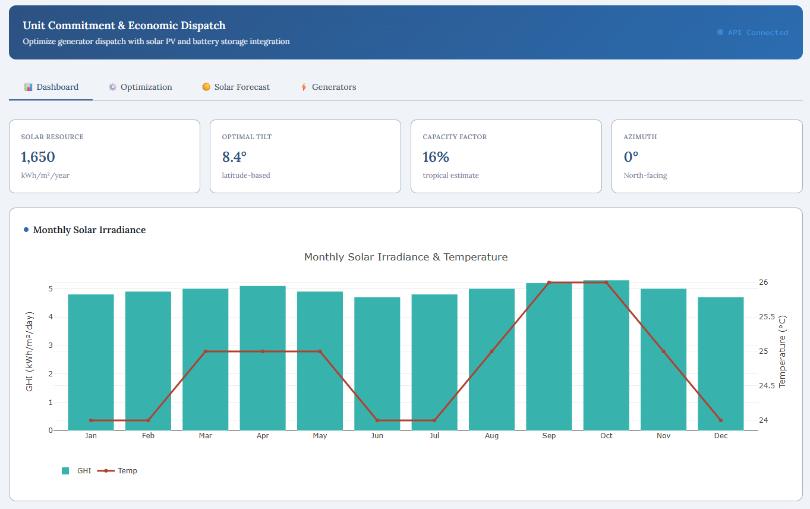

# Solara Optima Platform

**Unit Commitment & Economic Dispatch Optimization with Renewable Integration**

A modern, AI-enhanced platform for optimizing power system operations with solar PV, battery storage, and conventional generators. Built for Indonesian energy markets with real-time data integration.

## Features

### Core Optimization
- **MILP Solver**: Unit commitment and economic dispatch using PuLP/Pyomo
- **Multi-Agent AI Forecasting**: Load and solar generation prediction with Ollama
- **Battery Storage**: Optimal BESS sizing and dispatch scheduling
- **Reserve Requirements**: Spinning, operating, and uncertainty reserves

### Renewable Integration
- **Solar PV Forecasting**: pvlib-based generation modeling
  - Location: Bandung, Indonesia (-6.9147°S, 107.6098°E, 768m)
  - Southern hemisphere optimized (azimuth 0° = North-facing)
  - Real-time weather data integration
- **Dynamic Data Sources**: Auto-updating module specs from CEC/Sandia databases

### Market Features
- **Indonesian IDR Mode**: PLN/IPP market rates (~15,000-16,000 Rp/USD)
- **Time-of-Use Pricing**: Optimize dispatch for tariff structures
- **Carbon Tracking**: Emissions monitoring and reporting
- **Grid Interaction**: Buy/sell decision optimization

## Tech Stack

### Backend
- **FastAPI**: Modern async Python web framework
- **PuLP/Pyomo**: MILP optimization
- **pvlib**: Solar PV system modeling
- **Ollama**: Local LLM for AI forecasting agents
- **PostgreSQL**: Time-series data storage

### Frontend
- **React + TypeScript**: Component-based UI
- **Plotly/Recharts**: Interactive visualizations
- **Tailwind CSS**: Modern styling
- **WebSocket**: Real-time updates

### Infrastructure
- **Docker**: Containerized deployment
- **Redis**: Caching and task queues
- **Celery**: Background job processing

## Project Structure

```
solara-optima-platform/
├── backend/
│   ├── app/
│   │   ├── api/          # REST API endpoints
│   │   ├── core/         # Config, security, logging
│   │   ├── models/       # Pydantic schemas, DB models
│   │   ├── services/     # Business logic (optimization, forecasting)
│   │   └── utils/        # Helpers, pvlib wrappers
│   ├── tests/
│   └── requirements.txt
├── frontend/
│   ├── src/
│   │   ├── components/   # Reusable UI components
│   │   ├── pages/        # Dashboard pages
│   │   └── utils/        # API clients, helpers
│   └── package.json
├── data/
│   ├── weather/          # TMY/historical weather data
│   └── load_profiles/    # Sample load profiles
├── scripts/              # Setup, data download scripts
└── docs/                 # Documentation
```

## Quick Start

### Prerequisites
- Python 3.10+
- Node.js 18+
- Ollama (for AI forecasting)
- Docker (optional, for containerized deployment)

### Backend Setup
```bash
cd backend
python -m venv venv
source venv/bin/activate
pip install -r requirements.txt
uvicorn app.main:app --reload --host 0.0.0.0 --port 8000
```

### Frontend Setup
```bash
cd frontend
npm install
npm run dev
```

### Ollama Setup
```bash
# Install forecasting models
ollama pull llama3.2
ollama pull mistral
```

## Configuration

### Location Settings (default: Bandung)
```yaml
location:
  latitude: -6.9147
  longitude: 107.6098
  altitude: 768
  timezone: Asia/Jakarta
  hemisphere: southern
  optimal_azimuth: 0  # North-facing
```

### Market Settings
```yaml
market:
  currency: IDR
  usd_idr_rate: 15500
  carbon_price: 50000  # Rp/tCO2
```

## API Endpoints

- `POST /api/v1/optimize/run` - Execute UC/ED optimization
- `GET /api/v1/forecast/solar` - Solar generation forecast
- `GET /api/v1/forecast/load` - Load forecast
- `POST /api/v1/generators` - Manage generator fleet
- `GET /api/v1/results/{job_id}` - Retrieve optimization results

## Screenshot



*Solara Optima Platform Dashboard - Blue-themed UI showing monthly solar irradiance, key metrics, and navigation tabs*

## License

MIT License

## Author

Zulfikar Aji Kusworo  
GitHub: [@zakusworo](https://github.com/zakusworo)  
Email: greataji13@gmail.com  
DOI: 10.5281/zenodo.19650332
