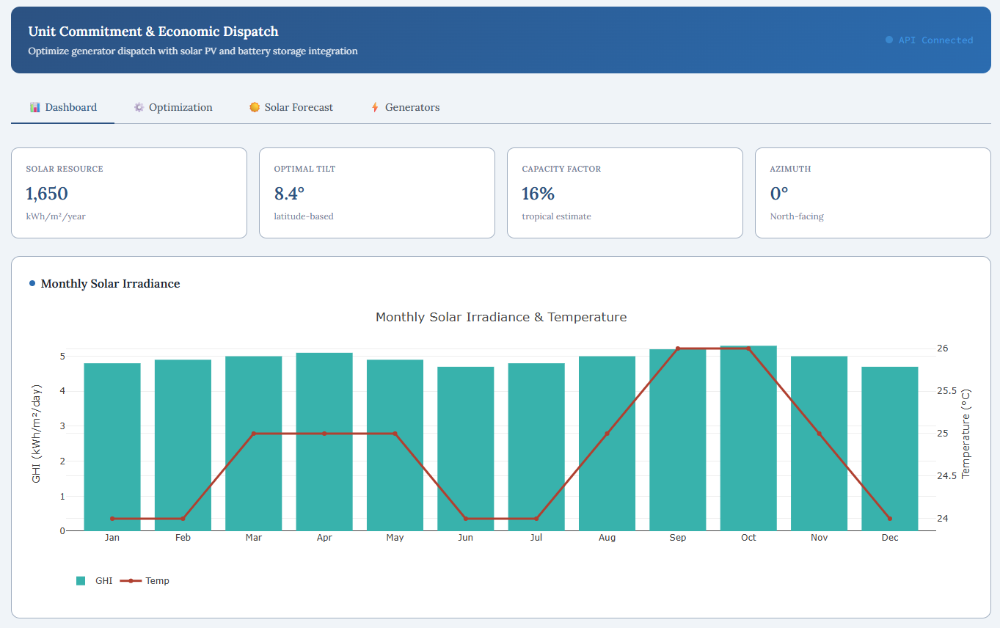

# Solara Optima Platform

**AI-Enhanced Unit Commitment & Economic Dispatch for Renewable-Integrated Power Systems**

[](https://www.python.org/)
[](https://fastapi.tiangolo.com/)
[](https://react.dev/)
[](./LICENSE)
[](https://doi.org/10.5281/zenodo.19653510)

A platform for accelerating **rooftop solar adoption in Indonesia**. On top of a
physics-based **solar PV** engine (pvlib) and a **UC/ED dispatch optimizer**, Solara
Optima adds a **Solar Aggregation & Financing Marketplace**: it turns a customer's PLN
bill into a right-sized system, a **bankable savings/ROI proposition**, a quantified
**CO₂-reduction** figure, and matches the project to **installers and financing**
(cash / green loan / zero-CapEx PPA).

**Repository**: https://github.com/zakusworo/solara-optima-platform

---

## Solar Aggregation & Financing Marketplace

> **CIIC 2026 track: Energy Transition** — promoting renewable-energy adoption and
> efficient resource use, with measurable GHG reduction.

The barrier to rooftop solar in Indonesia is rarely the panels — it's **upfront cost and
uncertainty about payback**. This layer removes both:

- **Bill → system**: enter a monthly PLN bill (or target kWp), get a right-sized system
  using pvlib-derived specific yield and self-consumption-aware savings (PLN export
  credit removed per Permen ESDM 2/2024 is modeled).
- **Bankable economics**: CAPEX, payback, IRR, NPV, LCOE and a **bankability score**,
  plus a side-by-side **cash / loan / PPA** comparison with 25-year cashflows.
- **Climate impact**: annual & lifetime **tCO₂ avoided** (grid emission factor) — the
  metric CIIC scores and the basis for carbon-credit potential.
- **Marketplace**: matches the sized project to **installer** and **financier** partners
  and captures **leads**; a **portfolio** view aggregates many rooftops into one
  investable pipeline.

Open the **Solar Marketplace** page in the app, or see [`docs/MARKETPLACE.md`](docs/MARKETPLACE.md)
for the full field-by-field CIIC mapping. Marketplace API lives under
`/api/v1/marketplace/*`.

**Docs:** [`docs/DEMO.md`](docs/DEMO.md) — step-by-step demo script, demo cities, and
ready-made scenarios · [`docs/ROADMAP.md`](docs/ROADMAP.md) — planned improvements.

---

## Highlights

- **MILP Solver** (PuLP) for mixed-integer optimal dispatch with generator constraints, ramp rates, min uptime/downtime
- **pvlib Integration** for physics-based solar generation forecasting using real meteorological data
- **PV Module Database** with 10,000+ CEC modules — search, filter, and auto-scale plant capacity by module selection
- **Battery Storage (BESS)** with binary charge/discharge mode, SOC tracking, and efficiency losses
- **Multi-Agent AI Forecasting** via Ollama LLMs for load and solar prediction
- **Auto Geolocation** — browser GPS → OpenStreetMap reverse geocoding → fallback to backend config
- **Hourly Load Profile Editor** with live totals, peak/average stats, and interactive visual feedback
- **Indonesian Market Mode** with IDR currency, PLN tariff structures, and carbon pricing

---

## Features

### Core Optimization (MILP)

| Feature | Description |
|---------|-------------|
| **UC/ED Solver** | MILP formulation via PuLP — schedules generator on/off and dispatch levels |
| **Generator Constraints** | Min/max output, ramp-up/down limits, min uptime/downtime, startup/shutdown costs |
| **Solar PV Dispatch** | Forecasted solar generation injected as negative load into UC/ED |
| **BESS Scheduling** | Binary mode charge/discharge with SOC dynamics and round-trip efficiency |
| **Reserve Requirements** | Spinning, operating, and uncertainty reserves enforced per period |
| **Multi-Period Rolling Horizon** | 24h+ optimization with time-of-use tariff awareness |

### Solar PV Forecasting

| Feature | Description |
|---------|-------------|
| **pvlib Physics Engine** | Position-of-sun, irradiance transposition, temperature derating, DC-DC modeling |
| **Location-Aware** | Defaults to Bandung, Indonesia (-6.9147 S, 107.6098 E, 768 m) with auto browser geolocation fallback |
| **Southern Hemisphere Optimized** | Azimuth 0 = North-facing (correct for Indonesia) |
| **Override Parameters** | Query-time overrides for latitude, longitude, altitude, tilt, azimuth |
| **Weather Integration** | Real-time/past weather data via pvlib/pandas TMY data |
| **Hourly Resolution** | Up to 168h forecast horizon |

### PV Module Database

| Feature | Description |
|---------|-------------|
| **CEC Module Cache** | 10,000+ commercial PV modules cached locally from CEC/Sandia databases |
| **Search & Filter** | By manufacturer, technology (Mono/Multi/CdTe), power range, text search |
| **Module Selection** | Click-to-select from browsable table; auto-suggests plant capacity based on module wattage |
| **Manual Entry** | Override with custom STC/PTC, efficiency, Vmp, Imp, temperature coefficients |
| **Auto-Scaling** | Enter desired plant capacity (kW) — frontend calculates module count and total output |

### AI Forecasting Agents

| Feature | Description |
|---------|-------------|
| **Ollama Integration** | Local LLM agents (Qwen3.5, accessible via `/api/v1/ai/*`) |
| **Load Forecasting** | LLM-based pattern recognition on historical load data |
| **Solar Forecasting** | AI-augmented correction to physics-based pvlib forecasts |
| **Fallback Mode** | Graceful degradation to statistical methods when Ollama unavailable |

### Frontend UX

| Feature | Description |
|---------|-------------|
| **Auto Location Detection** | `navigator.geolocation` → Nominatim reverse geocode → backend fallback |
| **Hourly Load Editor** | 24 editable cells with live daily totals, peak, and average kW |
| **Interactive Plotly Charts** | Generation forecasts, load profiles, dispatch schedules, temperature curves |
| **Responsive Layout** | Tailwind CSS with mobile sidebar, presentation-mode typography |
| **Real-Time Status** | Generation status, cost summaries, capacity factors |

---

## Architecture

```
                    +------------------+
                    |   React + Vite   |
                    |   (Frontend)     |
                    +--------+---------+
                             |
           +-----------------+------------------+
           |                                    |
    +------v-------+     +----------+     +------v-------+
    |   Plotly     |     |  Axios   |     |  Leaflet   |
    |  Charts      |     |  REST    |     |   Map      |
    +--------------+     +----+-----+     +------------+
                              |
                    +---------v-----------+
                    |    FastAPI (8000)   |
                    |    Python Backend   |
                    +----+----------+-----+
                         |          |
            +------------+          +------------+
            |                                    |
     +------v-------+                    +------v-------+
     |   UC/ED      |                    |  Solar/Weather |
     |   Optimizer  |                    |  Forecasting   |
     |   (PuLP)     |                    |  (pvlib)       |
     +--------------+                    +------+---------+
                                                |
                                   +------------+------------+
                                   |                         |
                            +------v-----+           +------v------+
                            |    CEC     |           |   Ollama    |
                            |  Module DB |           |   (LLMs)    |
                            +------------+           +-------------+
```

---

## Tech Stack

| Layer | Technology |
|-------|------------|
| **Backend** | FastAPI, Pydantic, Uvicorn |
| **Optimization** | PuLP (CBC), NumPy, SciPy |
| **Solar Physics** | pvlib, pandas, requests |
| **AI/ML** | Ollama (local LLMs), scikit-learn, Prophet |
| **Frontend** | React 18, TypeScript, Vite |
| **Visualization** | Plotly.js, Recharts, Leaflet |
| **Styling** | Tailwind CSS, Radix UI, Lucide icons |
| **State** | Zustand, React Query |

---

## API Endpoints

| Method | Endpoint | Description |
|--------|----------|-------------|
| `POST` | `/api/v1/optimize/run` | Run UC/ED optimization |
| `POST` | `/api/v1/optimize/run-with-solar` | UC/ED with auto solar forecast |
| `GET`  | `/api/v1/optimize/results/{job_id}` | Retrieve a stored optimization result |
| `GET`  | `/api/v1/optimize/status` | Solver config & availability |
| `GET`  | `/api/v1/forecast/solar` | Solar generation forecast (pvlib) |
| `GET`  | `/api/v1/forecast/load` | Statistical load forecast |
| `GET`  | `/api/v1/ai/load` | AI/LLM load forecast (synthetic input — see response `data_source`) |
| `POST` | `/api/v1/ai/load/custom` | AI load forecast from caller-supplied historical data |
| `GET`  | `/api/v1/pv/modules/search` | Search CEC PV module database |
| `GET`  | `/api/v1/pv/modules/{name}` | PV module detail |
| `GET`  | `/api/v1/weather/current` | Current weather data |
| `GET`  | `/api/v1/location/current` | Backend default location config |
| `GET`  | `/api/v1/generators/templates` | List built-in generator templates |
| `GET`  | `/api/v1/generators/presets/indonesia` | Indonesia market presets |
| `POST` | `/api/v1/generators/create` | Validate a custom generator definition |
| `GET`  | `/api/v1/marketplace/tariffs` | PLN tariff groups for bill→kWh conversion |
| `POST` | `/api/v1/marketplace/estimate` | Size a system + full financing/CO₂ analysis |
| `GET`  | `/api/v1/marketplace/installers` | Browse/filter installer partners |
| `GET`  | `/api/v1/marketplace/financiers` | Browse/filter financing products |
| `POST` | `/api/v1/marketplace/match` | Match a sized project to installers + financiers |
| `POST` | `/api/v1/marketplace/quote-request` | Submit a customer lead |
| `GET`  | `/api/v1/marketplace/portfolio` | Aggregated pipeline stats (capacity, CO₂) |

---

## Quick Start

### Prerequisites
- Python 3.10+
- Node.js 18+
- Ollama (optional, for AI forecasting)

### Backend
```bash
cd backend
python -m venv .venv
source .venv/bin/activate
pip install -r requirements.txt
uvicorn app.main:app --reload --host 0.0.0.0 --port 8000
```

### Frontend
```bash
cd frontend
npm install
npm run dev        # Vite dev server on :3000 (configured in vite.config.ts)
```

### Ollama (optional)
```bash
ollama pull qwen3.5        # Or any local model
ollama serve               # Must be running for AI features
```

---

## Configuration

Environment variables in `backend/.env`:

```env
LATITUDE=-6.9147
LONGITUDE=107.6098
ALTITUDE=768
TIMEZONE=Asia/Jakarta
BASE_CURRENCY=IDR
USD_IDR_RATE=15500
CARBON_PRICE=50000
SOLVER_NAME=CBC
```

---

## Project Structure

```
solara-optima-platform/
├── backend/
│   ├── app/
│   │   ├── api/               # REST endpoints (optimize, forecast, pv_modules, ai, weather, location)
│   │   ├── core/              # Config, logging, security
│   │   ├── models/            # Pydantic schemas
│   │   ├── services/          # Optimizer, solar_forecast, pv_module_db, ai_forecast
│   │   └── main.py            # FastAPI app factory
│   ├── data/
│   │   ├── cec_modules_cache.json          # 10K+ CEC module specs
│   │   ├── cec_modules_timestamp.txt        # Cache freshness marker
│   │   ├── load_profiles/      # Sample daily profiles
│   │   └── weather/            # TMY data files
│   ├── tests/
│   └── requirements.txt
├── frontend/
│   ├── src/
│   │   ├── pages/             # Dashboard, Optimization, SolarForecast, Generators, Settings
│   │   ├── components/        # Layout, LocationMap
│   │   ├── App.tsx
│   │   └── main.tsx
│   └── package.json
├── docs/
│   └── screenshot-dashboard.png
├── docker-compose.yml
├── LICENSE
└── README.md
```

---

## Screenshots

### Dashboard


### Solar Forecast with PV Module Selection
Browse 10,000+ CEC modules, filter by manufacturer/technology, and auto-scale plant capacity.

### Optimization with Hourly Load Editor
24-cell editable load profile with live kWh totals and interactive Plotly charting.

---

## Recent Updates

| Date | Change |
|------|--------|
| **May 2026** | Compose healthchecks across all services; ordered startup via `service_healthy` |
| **May 2026** | Generator templates extracted to `backend/data/generator_templates.json` (editable without code) |
| **May 2026** | Synthetic-input AI endpoints now flagged with `data_source: "synthetic"` |
| **May 2026** | Magic-number constants documented (CBC MIP gap, tropical tilt formula citations) |
| **May 2026** | CORS restricted to `CORS_ORIGINS` allowlist; `DEBUG=false` default |
| **May 2026** | Compose secrets moved to `.env` (no plaintext defaults); db port no longer host-exposed |
| **May 2026** | CEC modules CSV download hardened (`SHA256` verify, 50 MB cap, min-row sanity) |
| **May 2026** | Bounded LRU + 24h TTL on optimization result store (memory-leak fix) |
| **May 2026** | Frontend API URLs unified via `utils/api.ts` + `VITE_API_URL` (no more hardcoded `localhost:8000`) |
| **May 2026** | CI fail-loud: removed `\|\| echo` patterns; Trivy scan now blocks on HIGH/CRITICAL |
| **Apr 2026** | PV Module Database: CEC search + filter + manual entry + auto-scaling |
| **Apr 2026** | Auto geolocation: browser GPS → Nominatim → backend fallback |
| **Apr 2026** | Hourly load profile editor with live stats on Optimization page |
| **Apr 2026** | BESS binary charge/discharge mode fix, SOC constraint scaling |
| **Apr 2026** | Solar forecast unit fixes (kW/kWh consistency, no double divide-by-1000) |
| **Apr 2026** | Altitude override param added to forecast API |
| **Apr 2026** | Frontend presentation-mode typography and sidebar sizing |
| Apr 2026 | Location map + geocoding integration |
| Apr 2026 | Blue-themed dashboard UI |
| v1.0.0 | Initial release — UC/ED MILP, pvlib forecasting, Ollama AI |

---

## License

MIT License — see [LICENSE](./LICENSE)

## Author

**Zulfikar Aji Kusworo**  
GitHub: [@zakusworo](https://github.com/zakusworo)  
Email: greataji13@gmail.com  
DOI: [10.5281/zenodo.19653510](https://doi.org/10.5281/zenodo.19653510)
